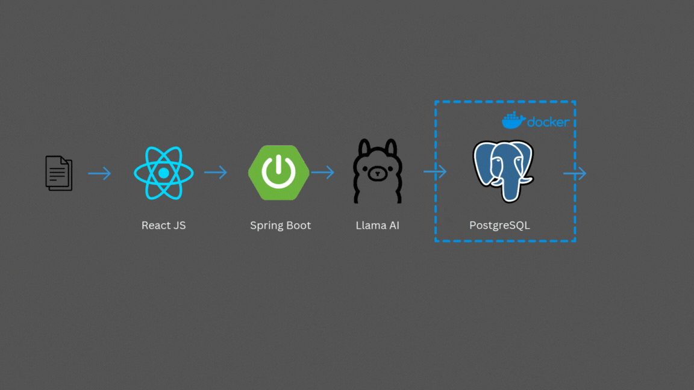

# Document to JSON Converter

<div align="center">
  
</div>

A full-stack application that converts various document formats (PDF, DOCX, Images) into structured JSON format using OCR technology and Large Language Models.

## 🌟 Features

- Supports multiple file formats:
  - PDF documents
  - DOCX files
  - Images (PNG, JPG, JPEG)
- OCR capability using Tesseract
- Real-time conversion progress display
- Interactive drag-and-drop interface
- JSON preview with typewriter effect
- Download converted JSON


## 🏗️ Technology Stack

### Backend
- Java Spring Boot
- Spring AI
- Apache PDFBox
- Apache POI
- Tesseract OCR
- JPA/Hibernate

### Frontend
- React.js
- Axios
- Lucide React Icons
- Tailwind CSS

## 🚀 Getting Started

### Prerequisites

1. Java 17 or higher
2. Node.js and npm
3. Maven
4. LLM API access

### Installing Tesseract OCR

#### Windows
1. Download the Tesseract installer from the [official release page](https://github.com/UB-Mannheim/tesseract/wiki)
2. Run the installer and note the installation path (default: `C:\Program Files\Tesseract-OCR`)
3. Add Tesseract to system environment variables:
   - Open System Properties → Advanced → Environment Variables
   - Under System Variables, find and select "Path"
   - Click "Edit" and add the Tesseract installation path
   - Click "OK" to save

#### Linux
```bash
sudo apt update
sudo apt install tesseract-ocr
sudo apt install libtesseract-dev
```

#### macOS
```bash
brew install tesseract
```

After installation, verify Tesseract is correctly installed:
```bash
tesseract --version
```

### Setting up the LLM API

For LLM API setup and configuration, please visit:
[LLM API Repository](https://github.com/Ayoubater23/LlmApi)

### Backend Setup

1. Clone this repository
2. Navigate to the backend directory
3. Run the Spring Boot application:
```bash
mvn spring-boot:run
```

If you encounter Tesseract-related errors, ensure that:
- Tesseract is properly installed
- The installation path is correctly added to your system's PATH environment variable
- You can run `tesseract --version` from the command line successfully

### Frontend Setup

1. Navigate to the frontend directory
2. Install dependencies:
```bash
npm install
```
3. Start the development server:
```bash
npm start
```

## 💡 Usage

1. Access the application at `http://localhost:3000`
2. Drop or select a supported file (PDF, DOCX, or Image)
3. Wait for the conversion process to complete
4. Preview the generated JSON
5. Download the JSON file if needed

## 📝 API Endpoints

- `POST /api/fileConverter/upload` - Upload and convert file
- `GET /api/fileConverter` - Get all converted files
- `GET /api/fileConverter/json/{fileId}` - Get specific JSON conversion
- `POST /api/fileConverter/generate/{fileId}` - Generate new JSON from existing file

## 🙏 Acknowledgments

- [Spring Boot](https://spring.io/projects/spring-boot)
- [React](https://reactjs.org/)
- [Tesseract OCR](https://github.com/tesseract-ocr/tesseract)
- [Apache PDFBox](https://pdfbox.apache.org/)
- [Apache POI](https://poi.apache.org/)

---
Made with ❤️ by Ayoub Atir
